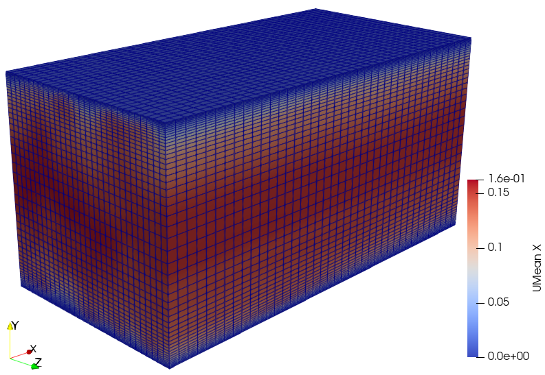
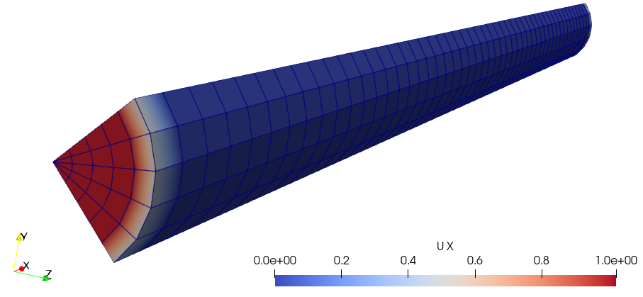

# FoamPyAverager

## ⚡ Quick Overview
FoamPyAverager provides various methods to perform domain-averaging of OpenFOAM results, including spanwise and polar averaging.

## ⚙️ Installation
This package was developed with Python 3.13 and the following libraries:
- matplotlib 3.10.8
- numpy 2.4.2
- scikit_learn 1.8.0

To install:
```python
git clone https://github.com/anthonychm/FoamPyAverager.git
cd FoamPyAverager
pip install -r requirements.txt
```

## 📘 Example 1: Spanwise Averaging
This example demonstrates the use of FoamPyAverager to perform spanwise averaging on the channel395 OpenFOAM tutorial result. The channel395 tutorial case models turbulent flow through a plane channel using LES.


## 📘 Example 2: Polar Averaging
This example demonstrates the use of FoamPyAverager to perform polar averaging on the pipeCyclic OpenFOAM tutorial result. The pipeCyclic tutorial case models turbulent flow through a pipe using RANS, where only a quarter of the pipe has been modelled.

