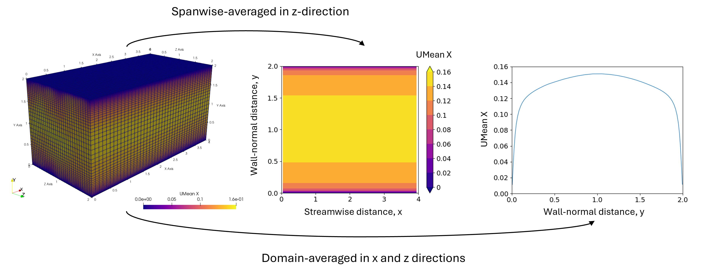
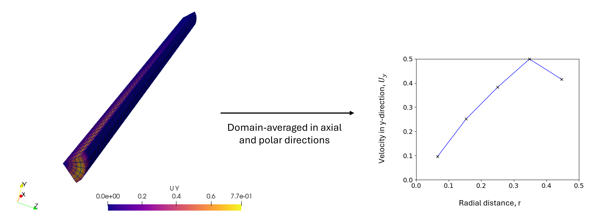
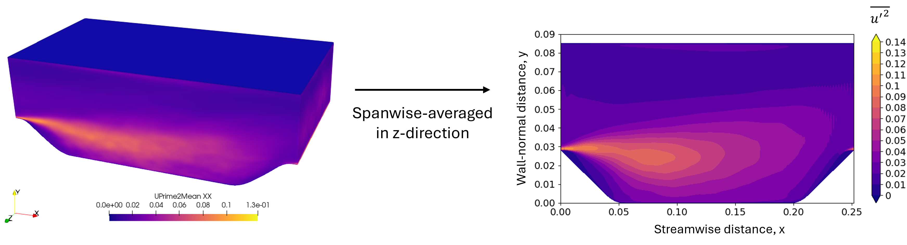

# FoamPyAverager

## ⚡ Quick Overview
FoamPyAverager is a Python package that contains various scripts to perform domain-averaging of OpenFOAM results. 
Some examples to demonstrate its capabilities are provided below:

### Example 1
Domain-averaging of a turbulent plane channel flow in the streamwise (x) and spanwise (z) directions
<p align="center">

</p>

### Example 2
Domain-averaging of a turbulent pipe flow in the axial and tangential (θ) directions
<p align="center">

</p>

### Example 3
Domain-averaging of a flow over periodic hills in the spanwise (z) direction
<p align="center">

</p>

## ⚙️ Installation
This package was developed with Python 3.13 and the following libraries:
- matplotlib 3.10.8
- numpy 2.4.2
- scikit_learn 1.8.0

Run the following to install the package:
```python
git clone https://github.com/anthonychm/FoamPyAverager.git
cd FoamPyAverager
pip install -r requirements.txt
```
Please visit the [Get Started](docs/get_started.md) page for documentation on the scripts in this package.