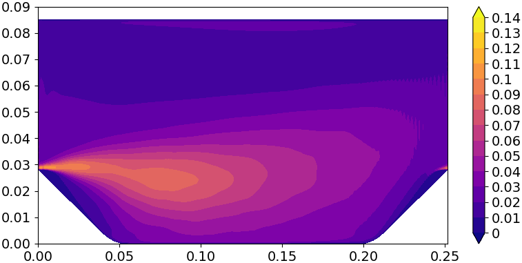

# plot_tri_contour

```python
 py -m  foampyaverager.scripts.plot_tri_contour --unique_coords_path --avg_var_path --avg_var_col --x_ticks --y_ticks --c_levels --cmap --save_name
```

Create a tri-contour plot for a domain-averaged result after running the calc_cartesian_average script on a curvilinear 
mesh. This script internally runs the tricontourf function from Matplotlib.

# Input Arguments
- **--unique_coords_path**: string  
Relative file path to the unique coordinates file
- **--avg_var_path**: string  
Relative file path to the averaged variable file
- **--avg_var_col**: int  
Column of the averaged variable to be plotted
- **--x_ticks**: string  
x ticks of the contour plot
- **--y_ticks**: string  
y ticks of the contour plot
- **--c_levels**: string  
contour levels of the contour plot
- **--cmap**: string  
colour map of the contour plot
- **--save_name**: string  
File name for saving the contour plot

## Outputs
- .png file of the contour plot

## Example
Let's plot a tri-contour of the spanwise (z) averaged streamwise Reynolds stress $\overline{u'u'}$ calculated after running 
calc_cartesian_average on the periodHill case. The unique coordinates file and averaged variable file are called 
"unique_Cx_Cy" and "averaged_UPrime2Mean" as shown in the third [calc_cartesian_average](calc_cartesian_average.md) example. 
As $\overline{u'u'}$ is the first column in the averaged_UPrime2Mean file, the avg_var_col index is 0.

```python
py -m  foampyaverager.scripts.plot_tri_contour --unique_coords_path "unique_Cx_Cy" --avg_var_path "averaged_UPrime2Mean" --avg_var_col 0 --x_ticks "[0, 0.05, 0.10, 0.15, 0.20, 0.25]" --y_ticks "[0, 0.01, 0.02, 0.03, 0.04, 0.05, 0.06, 0.07, 0.08, 0.09]" --c_levels "[0, 0.01, 0.02, 0.03, 0.04, 0.05, 0.06, 0.07, 0.08, 0.09, 0.10, 0.11, 0.12, 0.13, 0.14]" --cmap "plasma" --save_name "periodicHill_contour.png"
```

Running this line saves the following figure called "periodicHill_contour.png":

<p align="center">

</p>